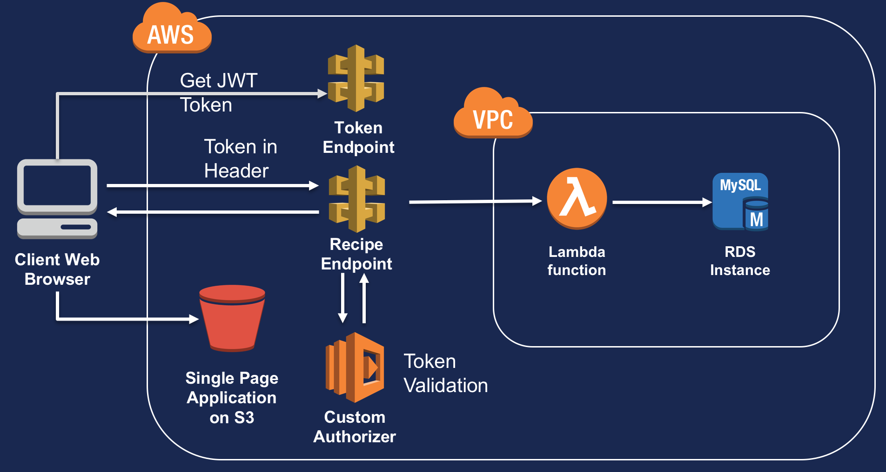

# GrandmasRecipes

A demo web application to showcase API Gateway custom authorizers in .NET Core.

### Pre-Requisites

* Install .NET Core 2.0

* Install Visual Studio or Rider

* If you are using Windows, install the AWS Toolkit for Visual Studio

-----

The application is made up of a frontend which is a single page application and a .NET-based solution which serves as the API.

----

## Front End

This is a single page web application in /UI. It consists of a HTML page that uses AJAX calls to an API endpoint. The web application is designed to show the delicious recipes that Grandma has created over the years, but unfortunately she's forgotten to lock-down her API.

## API

The API is a .NET Core application and laid out as a Visual Studio .sln solution. These are the projects.

### DataLayer

This is the DbContext for Entity Framework to access the database where all the delicious recipes are stored. The connection string uses AWS SSM parameter store to make sure it doesn't fall into the wrong hands.

### Entities

This project contains the data model for the database objects. It currently only has one object, a Recipe.

### Security

This is a shared class library between the token issuer and the token validator which contains the shared secrets.

To be more secure, this could probably be locked down using AWS SSM parameter store.

### RecipesAPI

This is an ASP.NET Web API project that is used to serve recipes out using the RecipesController. Using the AWS toolkit for Visual Studio, you can deploy this easily as a serverless application using API Gateway and AWS Lambda.

### RecipesAPI.Tokens

This is an ASP.NET Web API Project that issues tokens for the custom authorizer to validate.  Using the AWS toolkit for Visual Studio, you can deploy this easily as a serverless application using API Gateway and AWS Lambda.

### Recipes.API.Authorizer

This is a AWS Lambda project that is used as a custom authorizer to validate tokens issued using the tokens project. By configuring API Gateway to use this as a custom authorizer, you can take load off your web servers/reverse proxies by offloading AuthZ using this AWS Lambda function.

### *What are the key libraries/dependencies/NuGet pacakges?*

Remember, we're dealing with security so as far as possible, we want to use standard libraries and not roll our own. The ones that we are using in this project are:

* Microsoft.IdentityModel.Tokens

* System.IdentityModel.Tokens.Jwt

Of course, we are dealing with AWS so the AWS SDK for .NET is going to be used.

* AWSSDK.Core
* AWSSDK.SimpleSystemsManagement

Building AWS serverless applications with for .NET are a lot easier once you have imported the object model libraries:

* Amazon.Lambda.APIGatewayEvents
* Amazon.Lambda.Core
* Amazon.Lambda.Serialization.Json
* Amazon.Lambda.AspNetCoreServer

